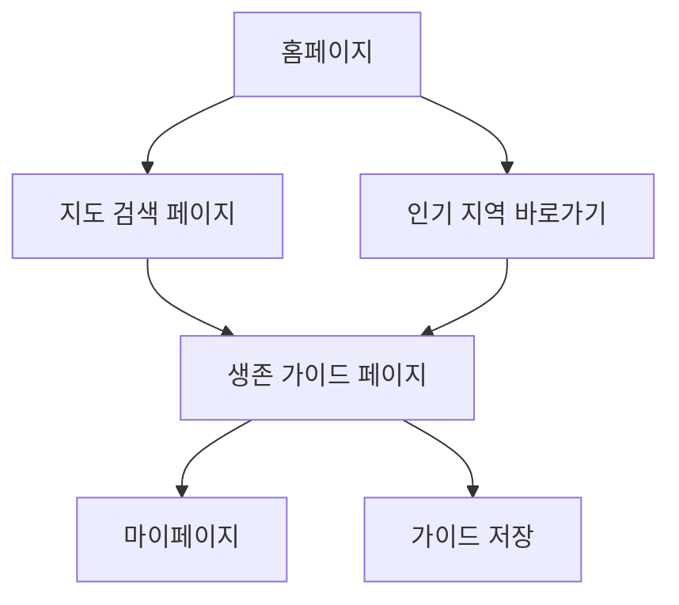

## 1. Product Overview
Arnis Scout는 OpenStreetMap(OSM)의 실제 지형 데이터를 기반으로 마인크래프트 생존 가이드를 AI가 생성해주는 서비스입니다. 실제 지역의 지형 정보를 분석하여 마인크래프트에서의 생존 전략, 자원 위치, 위험 요소 등을 제공합니다.

문제 해결: 마인크래프트 플레이어들이 실제 지역을 기반으로 한 생존 전략이 필요하지만, 이를 체계적으로 제공하는 서비스가 부족함
사용자: 마인크래프트 생존 모드 플레이어, 특히 실제 지역을 기반으로 한 도전을 원하는 사용자
시장 가치: 게이밍과 GIS(지리정보시스템)의 결합으로 독특한 경험 제공

## 2. Core Features

### 2.1 User Roles
| Role | Registration Method | Core Permissions |
|------|---------------------|------------------|
| 일반 사용자 | 이메일 또는 소셜 로그인 | 지도 검색, 생존 가이드 생성, 가이드 저장 |
| 프리미엄 사용자 | 유료 구독 | 고급 AI 분석, 무제한 가이드 생성, 커스텀 설정 |

### 2.2 Feature Module
Arnis Scout의 주요 페이지:
1. **홈페이지**: 지도 검색, 인기 지역 소개, 기능 소개
2. **지도 검색 페이지**: OSM 지도 연동, 지역 선택, 확대/축소
3. **생존 가이드 페이지**: AI 분석 결과, 생존 전략, 자원 위치 정보
4. **마이페이지**: 저장된 가이드, 통계, 설정

### 2.3 Page Details
| Page Name | Module Name | Feature description |
|-----------|-------------|---------------------|
| 홈페이지 | 히어로 섹션 | 실제 지도와 마인크래프트 월드가 결합된 비주얼 표시, 주요 기능 소개 |
| 홈페이지 | 지도 검색 바 | 지역명 입력 자동완성, 빠른 검색 기능 |
| 홈페이지 | 인기 지역 | 다른 사용자들이 많이 검색한 지역 Top 10 표시 |
| 지도 검색 페이지 | OSM 지도 통합 | 실시간 지도 로딩, 마커 표시, 지역 경계 표시 |
| 지도 검색 페이지 | 지역 선택 도구 | 사각형/원형 선택, 드래그로 영역 지정 |
| 지도 검색 페이지 | 지형 분석 | 고도, 수위, 식생 등 지형 정보 실시간 분석 |
| 생존 가이드 페이지 | AI 분석 결과 | ChatGPT API를 활용한 생존 전략 생성 |
| 생존 가이드 페이지 | 자원 맵 | 주요 광물, 나무, 동물 서식지 시각화 |
| 생존 가이드 페이지 | 위험 요소 | 몬스터 스폰 가능 지역, 난이도 평가 |
| 마이페이지 | 저장된 가이드 | 이전에 생성한 가이드 목록, 북마크 기능 |
| 마이페이지 | 통계 | 방문한 지역 수, 생존률 예측 등 게이미피케이션 요소 |

## 3. Core Process

### 일반 사용자 플로우:
1. 홈페이지 접속 → 지도 검색 또는 인기 지역 선택
2. 지도에서 원하는 지역 선택 및 확대/축소
3. "생존 가이드 생성" 버튼 클릭
4. AI 분석 진행 (로딩 화면 표시)
5. 생존 가이드 결과 확인 및 저장

### 프리미엄 사용자 플로우:
1. 기본 플로우와 동일하지만 추가 옵션 선택 가능
2. 커스텀 난이도 설정, 특수 규칙 추가
3. 고급 분석 옵션 활용

## 4. User Interface Design

### 4.1 Design Style
- **Primary Colors**: 마인크래프트 블록 스타일의 녹색(#5E7C16), 갈색(#8B4513