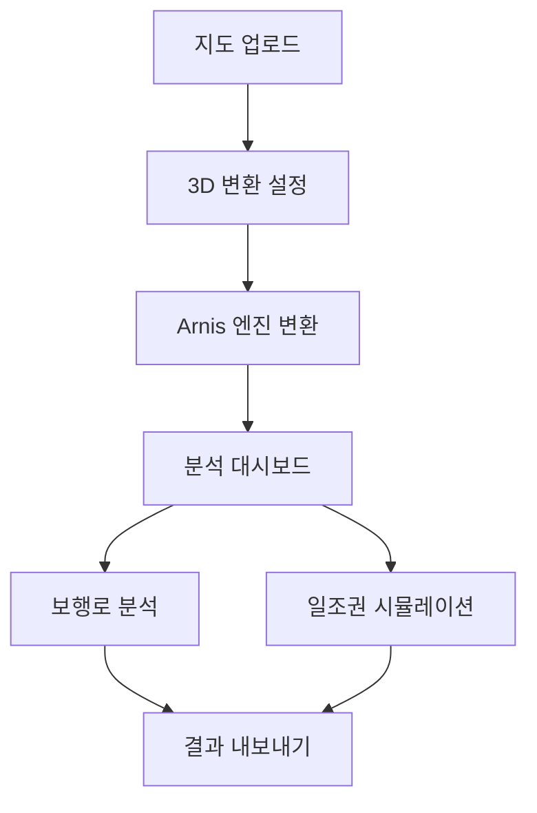

## 1. Product Overview
현실 도시 지형 데이터를 마인크래프트 월드로 변환하여 보행로 접근성과 일조권을 분석하는 도시 환경 분석 에이전트. 도시 계획자와 건축가에게 직관적인 3D 시각화를 통한 의사결정 지원을 제공합니다.

## 2. Core Features

### 2.1 User Roles
| Role | Registration Method | Core Permissions |
|------|---------------------|------------------|
| 일반 사용자 | 이메일 회원가입 | 기본 지도 조회, 분석 결과 보기 |
| 전문가 사용자 | 이메일 + 자격증 인증 | 고급 분석 도구 사용, 데이터 내보내기 |

### 2.2 Feature Module
1. **지도 업로드 페이지**: 지형 데이터 파일 업로드, 좌표계 설정
2. **3D 변환 페이지**: Arnis 엔진을 통한 마인크래프트 월드 생성, 실시간 변환 진행률
3. **분석 대시보드**: 보행로 접근성 분석, 일조권 시뮬레이션, 결과 내보내기

### 2.3 Page Details
| Page Name | Module Name | Feature description |
|-----------|-------------|---------------------|
| 지도 업로드 페이지 | 파일 업로드 | GeoJSON, Shapefile 형식의 지형 데이터 업로드 |
| 지도 업로드 페이지 | 좌표계 설정 | WGS84, UTM 등 좌표계 선택 및 변환 |
| 3D 변환 페이지 | 변환 설정 | 건물 높이, 텍스처 품질, 지형 정밀도 설정 |
| 3D 변환 페이지 | 실시간 진행률 | Arnis 엔진 변환 상태 표시, 예상 소요 시간 |
| 분석 대시보드 | 보행로 분석 | 출발지-목적지 간 최단 경로, 경사도, 장애물 식별 |
| 분석 대시보드 | 일조권 시뮬레이션 | 시간대별 일조량, 그림자 분포, 계절별 변화 |
| 분석 대시보드 | 결과 시각화 | 색상-coded 맵, 차트, 3D 오버레이 표시 |
| 분석 대시보드 | 리포트 생성 | PDF/PNG 형식으로 분석 결과 내보내기 |

## 3. Core Process
사용자는 지형 데이터 파일을 업로드하고, Arnis 엔진이 자동으로 마인크래프트 월드를 생성합니다. 생성된 3D 공간에서 보행로 접근성과 일조권을 실시간으로 분석하여 시각화합니다.

## 4. User Interface Design

### 4.1 Design Style
- Primary: #2E8B57 (도시 녹색), Secondary: #4682B4 (강철 블루)
- 버튼: 둥근 모서리, 그림자 효과
- 폰트: Noto Sans KR, 14-16px 본문, 20-24px 제목
- 레이아웃: 카드 기반, 좌측 사이드바 네비게이션
- 아이콘: 둥근 라인 아이콘, 건축/도시 계획 테마

### 4.2 Page Design Overview
| Page Name | Module Name | UI Elements |
|-----------|-------------|-------------|
| 지도 업로드 페이지 | 파일 업로드 | 드래그앤드롭 영역, 파일 형식 안내, 진행률 바 |
| 3D 변환 페이지 | 변환 설정 | 슬라이더, 토글 스위치, 미리보기 창 |
| 분석 대시보드 | 3D 뷰어 | Three.js 기반 3D 뷰어, 줌/회전 컨트롤 |
| 분석 대시보드 | 분석 패널 | 탭 레이아웃, 실시간 차트, 범례 표시 |

### 4.3 Responsiveness
데스크톱 우선 설계, 태블릿 대응 가능하도록 반응형 그리드 적용