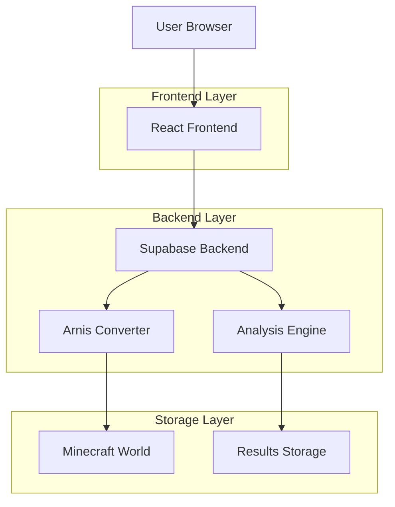
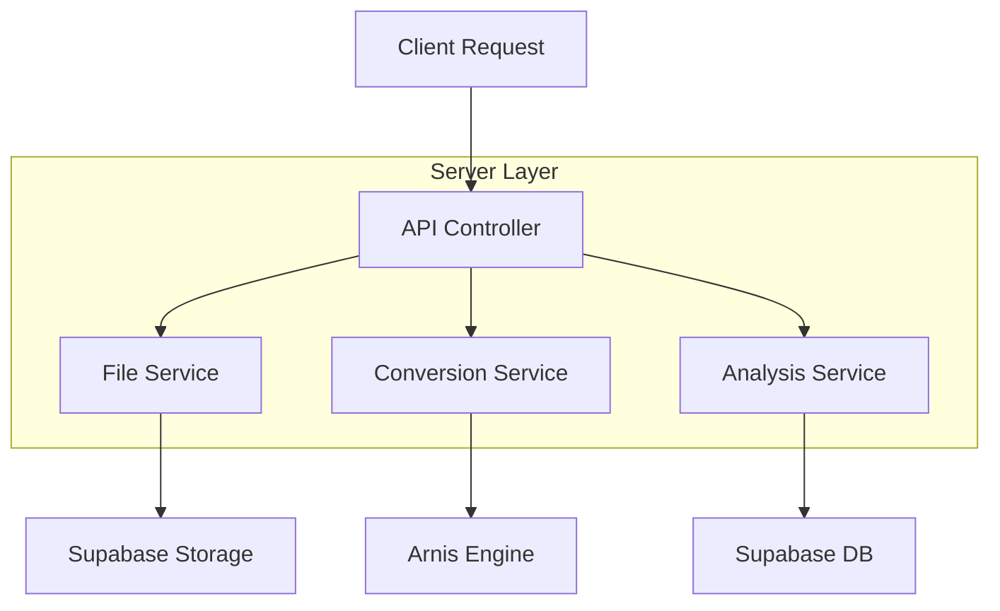
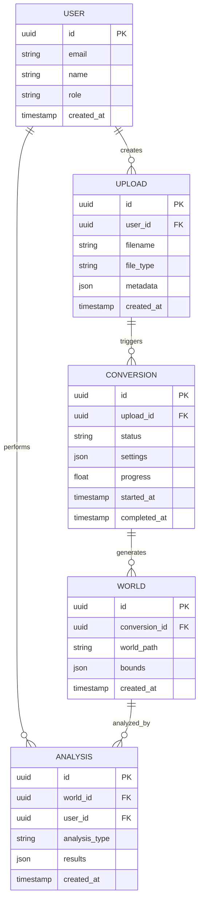

## 1. Architecture design



## 2. Technology Description
- Frontend: React@18 + Three.js@0.158 + tailwindcss@3 + vite
- Initialization Tool: vite-init
- Backend: Supabase (PostgreSQL + Storage)
- 3D Engine: Three.js, @react-three/fiber, @react-three/drei
- File Processing: shapefile@0.6, geojson@0.5

## 3. Route definitions
| Route | Purpose |
|-------|---------|
| / | 홈페이지, 서비스 소개 및 시작하기 |
| /upload | 지형 데이터 파일 업로드 페이지 |
| /convert | 3D 변환 설정 및 진행 페이지 |
| /dashboard | 분석 결과 대시보드 |
| /login | 사용자 인증 페이지 |

## 4. API definitions

### 4.1 File Upload API
```
POST /api/upload/terrain
```

Request:
| Param Name | Param Type | isRequired | Description |
|------------|-------------|-------------|-------------|
| file | File | true | 지형 데이터 파일 (GeoJSON/Shapefile) |
| coordinate_system | string | true | 좌표계 정보 (WGS84, UTM 등) |

Response:
| Param Name | Param Type | Description |
|------------|-------------|-------------|
| upload_id | string | 파일 업로드 식별자 |
| status | string | 업로드 상태 |

### 4.2 Conversion API
```
POST /api/convert/start
```

Request:
| Param Name | Param Type | isRequired | Description |
|------------|-------------|-------------|-------------|
| upload_id | string | true | 파일 업로드 ID |
| building_height | number | false | 건물 높이 배수 (기본값: 1.0) |
| texture_quality | string | false | 텍스처 품질 (low/medium/high) |

### 4.3 Analysis API
```
GET /api/analysis/accessibility
```

Request:
| Param Name | Param Type | isRequired | Description |
|------------|-------------|-------------|-------------|
| world_id | string | true | 생성된 월드 ID |
| start_point | object | true | 출발지 좌표 {x, y, z} |
| end_point | object | true | 목적지 좌표 {x, y, z} |

## 5. Server architecture diagram



## 6. Data model

### 6.1 Data model definition


### 6.2 Data Definition Language
```sql
-- Users table
CREATE TABLE users (
  id UUID PRIMARY KEY DEFAULT gen_random_uuid(),
  email VARCHAR(255) UNIQUE NOT NULL,
  name VARCHAR(100) NOT NULL,
  role VARCHAR(20) DEFAULT 'user' CHECK (role IN ('user', 'expert')),
  created_at TIMESTAMP WITH TIME ZONE DEFAULT NOW()
);

-- Uploads table
CREATE TABLE uploads (
  id UUID PRIMARY KEY DEFAULT gen_random_uuid(),
  user_id UUID REFERENCES users(id) ON DELETE CASCADE,
  filename VARCHAR(255) NOT NULL,
  file_type VARCHAR(50) NOT NULL,
  metadata JSONB,
  created_at TIMESTAMP WITH TIME ZONE DEFAULT NOW()
);

-- Conversions table
CREATE TABLE conversions (
  id UUID PRIMARY KEY DEFAULT gen_random_uuid(),
  upload_id UUID REFERENCES uploads(id) ON DELETE CASCADE,
  status VARCHAR(20) DEFAULT 'pending' CHECK (status IN ('pending', 'processing', 'completed', 'failed')),
  settings JSONB,
  progress FLOAT DEFAULT 0.0,
  started_at TIMESTAMP WITH TIME ZONE,
  completed_at TIMESTAMP WITH TIME ZONE
);

-- Worlds table
CREATE TABLE worlds (
  id UUID PRIMARY KEY DEFAULT gen_random_uuid(),
  conversion_id UUID REFERENCES conversions(id) ON DELETE CASCADE,
  world_path VARCHAR(500) NOT NULL,
  bounds JSONB,
  created_at TIMESTAMP WITH TIME ZONE DEFAULT NOW()
);

-- Analysis table
CREATE TABLE analysis (
  id UUID PRIMARY KEY DEFAULT gen_random_uuid(),
  world_id UUID REFERENCES worlds(id) ON DELETE CASCADE,
  user_id UUID REFERENCES users(id) ON DELETE CASCADE,
  analysis_type VARCHAR(50) NOT NULL,
  results JSONB,
  created_at TIMESTAMP WITH TIME ZONE DEFAULT NOW()
);

-- Indexes
CREATE INDEX idx_uploads_user_id ON uploads(user_id);
CREATE INDEX idx_conversions_upload_id ON conversions(upload_id);
CREATE INDEX idx_worlds_conversion_id ON worlds(conversion_id);
CREATE INDEX idx_analysis_world_id ON analysis(world_id);
CREATE INDEX idx_analysis_user_id ON analysis(user_id);

-- Row Level Security
ALTER TABLE uploads ENABLE ROW LEVEL SECURITY;
ALTER TABLE conversions ENABLE ROW LEVEL SECURITY;
ALTER TABLE worlds ENABLE ROW LEVEL SECURITY;
ALTER TABLE analysis ENABLE ROW LEVEL SECURITY;

-- Policies
CREATE POLICY "Users can view own uploads" ON uploads FOR SELECT USING (auth.uid() = user_id);
CREATE POLICY "Users can create uploads" ON uploads FOR INSERT WITH CHECK (auth.uid() = user_id);
CREATE POLICY "Users can view own analysis" ON analysis FOR SELECT USING (auth.uid() = user_id);
CREATE POLICY "Users can create analysis" ON analysis FOR INSERT WITH CHECK (auth.uid() = user_id);
```